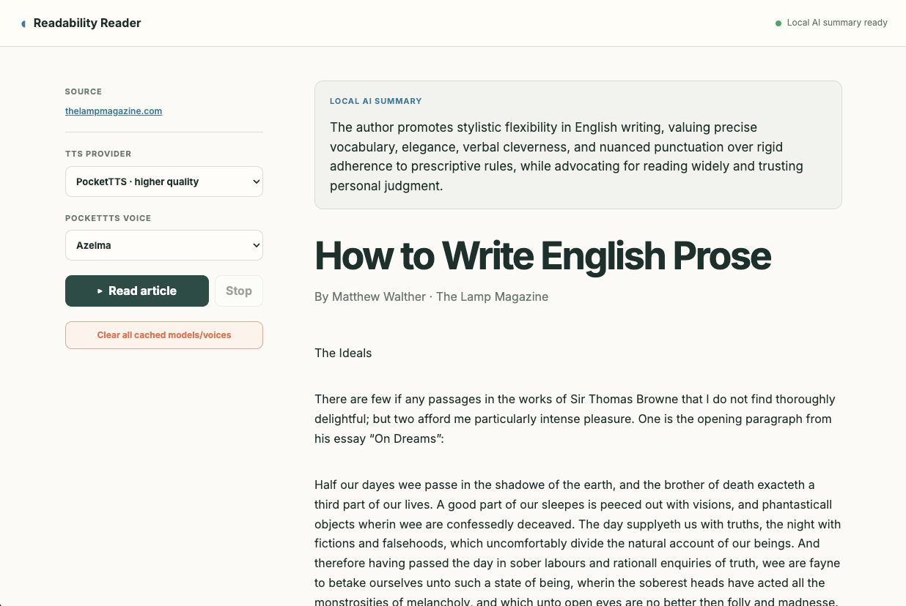

<p align="center">
  
</p>

<h1 align="center">Readability Reader</h1>

<p align="center">
  A private, local-first reader for articles, PDFs, X articles, and YouTube transcripts with AI summaries and natural text-to-speech.
</p>

<p align="center">
  <strong><a href="https://chromewebstore.google.com/detail/gpgkihaonhnhfabcmgnmkjlmoegfkbne">Install Readability Reader from the Chrome Web Store</a></strong>
</p>



## What it does

Readability Reader is a Manifest V3 browser extension for Chrome and Firefox. Click its toolbar button on an article, PDF, X long-form article, or YouTube video to open the content in a quiet, responsive reading view.

- Extracts article content locally with Mozilla Readability.
- Extracts X long-form articles from their dedicated rich-text container, including headings, lists, quotations, and images.
- Turns available YouTube captions and chapters into sentence-aware readable transcripts with speaker turns.
- Converts PDFs locally with PDF.js and preserves their text hierarchy and reading order.
- Detects PDF text, headings, pictures, tables, and formulas with a bundled DocLayNet layout model.
- Converts detected formulas to LaTeX locally and renders them with KaTeX.
- Produces concise on-device summaries with the browser's built-in Summarizer API when available.
- Reads content aloud with PocketTTS or Inflect Micro/Nano, with selectable voices and sentence-level highlighting.
- Saves processed articles, PDFs, YouTube transcripts, X articles, and generated local AI summaries so reader tabs survive refreshes without repeating work.
- Provides a private recent-reading library with Orama full-text and hybrid semantic search across titles, URLs, and content.
- Normalizes punctuation and URLs for more natural speech, skips navigation and code, and announces article images from their accessible descriptions.
- Downloads voice and optional recognition models only when needed, then keeps them in persistent browser storage for reuse.

Article extraction, PDF conversion, layout analysis, transcript formatting, speech synthesis, and supported summarization all happen locally. The extension does not send extracted content to an application server. YouTube metadata and captions are fetched directly from YouTube; model files are downloaded directly from Hugging Face when first required.

## Local library and search

Every successfully extracted article, processed PDF, and YouTube transcript receives a stable, URL-derived document ID and is saved in the browser with [localForage](https://github.com/localForage/localForage). Refreshing or reopening its reader URL restores the saved passages, PDF crops, reconstructed tables, formulas, metadata, and generated summary instead of downloading and processing the source again.

The library lists the 100 most recently viewed documents and searches their titles, source URLs, and complete extracted content. [Orama](https://github.com/oramasearch/orama) supplies BM25 full-text search, typo tolerance, vector indexing, and hybrid ranking. A quantized [all-MiniLM-L6-v2](https://huggingface.co/Xenova/all-MiniLM-L6-v2) model generates 384-dimensional embeddings locally through [Transformers.js](https://github.com/huggingface/transformers.js) and [ONNX Runtime Web](https://github.com/microsoft/onnxruntime). Embeddings are created in a dedicated worker, capped per document to control storage and indexing time, and stored alongside the document. Full-text indexing always covers the entire document.

The reader keeps a wide search box directly beside the **Readability Reader** logo, so the saved library is reachable without leaving the article controls. Entering a query opens the library with that search already active; the library keeps the same search box in its header and updates results as you type. Clicking the logo opens recent documents without a query, and clicking the extension toolbar icon from a page it cannot extract also opens the library.

Individual documents can be deleted directly from the reader or library, and the complete library can be cleared from the library page. Removing a document also removes its summary and embeddings; the local search index is rebuilt from the remaining records. No saved content, summaries, search terms, or embeddings leave the device.

## Build from source

Requirements: a current Node.js/npm installation and the `zip` command for release packaging.

```sh
npm install
npm run build
```

The build creates the bundled runtime files, fonts, PDF.js assets, and extension icons needed to load the source directory as an unpacked extension.

## Create browser packages

```sh
npm run package
```

Versioned Chrome and Firefox archives are written to `release/`. To create just one archive, run:

```sh
npm run package:chrome
npm run package:firefox
```

The Firefox package receives a Firefox-specific Manifest V3 background declaration and Gecko extension metadata. Both archives contain only runtime files—source-only files, npm metadata, and dependencies are excluded.

## Load an unpacked build

### Chrome

1. Run `npm install && npm run build`.
2. Open `chrome://extensions`.
3. Enable **Developer mode**.
4. Select **Load unpacked** and choose this repository directory.
5. Pin Readability Reader, open an article or PDF, and click its toolbar icon.

To open local `file:///…` PDFs, enable **Allow access to file URLs** in the extension's details.

### Firefox

1. Run `npm install && npm run package:firefox`.
2. Open `about:debugging#/runtime/this-firefox`.
3. Select **Load Temporary Add-on**.
4. Choose the generated Firefox ZIP in `release/`.

## PDF processing

PDF.js provides positioned text extraction and page rendering. A bundled DocLayNet YOLO model detects semantic page regions, visual crops preserve pictures and tables, and recursive XY-cut restores blocks to reading order. The reader normalizes body typography while preserving detected bold and italic blocks, promotes a likely title to H1, removes repeated marginal headers and footers, and derives library titles from the largest horizontal text in the first three pages. Formula regions are recognized with Texo/FormulaNet and rendered with KaTeX; table regions can be reconstructed with a locally downloaded recognition model.

Saved PDFs include a reprocess button for rerunning extraction after the pipeline improves. Numbered references support hover and keyboard previews, and citation jumps add a history entry so the browser Back button returns to the previous reading position.

## YouTube and X

For YouTube watch, short, live, embed, and share links, the extension requests available captions directly from YouTube and formats them into complete sentences with `Intl.Segmenter`. Chapter headings move to the end of the sentence containing their timestamp so they do not split speech. A `>>` marker starts an em-dash speaker paragraph only when followed by an uppercase word; false markers inside a sentence are removed.

X long-form articles use the platform's dedicated rich-text article container instead of generic page extraction. The extractor preserves semantic blocks and media, reads the dedicated article title, resolves author names and handles, replaces emoji images with accessible text, and requests larger X media variants. The implementation incorporates robust extraction patterns from Defuddle.

Image-only scanned PDFs have no extractable text and currently require a separate OCR engine.

## Local storage

Articles, processed PDFs, PDF visual crops, X articles, YouTube transcripts, summaries, and semantic embeddings are stored in IndexedDB through localForage. Downloaded voices and model weights use persistent browser caches so they do not need to be fetched for every reading session. **Clear all cached models/voices** removes model assets and resets the in-memory speech engines without deleting the reading library. Provider, voice, model, and playback preferences are stored separately in browser-local extension storage.

## Third-party components

- [Mozilla Readability](https://github.com/mozilla/readability) for article extraction.
- [Defuddle](https://github.com/kepano/defuddle) for robust X/Twitter extraction patterns (MIT).
- [PDF.js](https://github.com/mozilla/pdf.js) for PDF parsing and rendering (Apache-2.0).
- [KaTeX](https://katex.org/) for formula rendering.
- [Transformers.js](https://github.com/huggingface/transformers.js) and [ONNX Runtime Web](https://github.com/microsoft/onnxruntime) for local document and embedding inference.
- [all-MiniLM-L6-v2](https://huggingface.co/Xenova/all-MiniLM-L6-v2) for local semantic-search embeddings.
- [Orama](https://github.com/oramasearch/orama) for local full-text, vector, and hybrid search.
- [localForage](https://github.com/localForage/localForage) for durable browser-side document storage.
- [Texo / FormulaNet](https://github.com/alephpi/Texo) for formula recognition (AGPL-3.0).
- [PocketTTS](https://github.com/kyutai-labs/pocket-tts), [Inflect Micro](https://huggingface.co/owensong/Inflect-Micro-v2-ONNX), and [Inflect Nano](https://huggingface.co/owensong/Inflect-Nano-v2-ONNX) for local speech synthesis.
